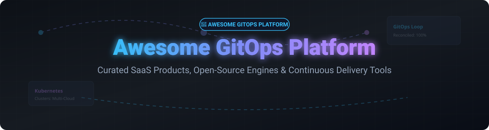

# 🚀 Awesome GitOps Platform

  

  
  
  
  

## 📌 Top GitOps Platforms & Ecosystem

**Curated List of SaaS Products & Open-Source GitHub Projects for Kubernetes & Cloud-Native Continuous Delivery**

*Focused on Declarative Continuous Delivery, Kubernetes Reconciliation, Multi-Cluster GitOps, Infrastructure-as-Code & Progressive Delivery*

**Last updated: September 2026** 📅

---

### 🌐 Market Size & Industry Dynamics

> 💡 **Market Insights:** The global GitOps and Cloud-Native Continuous Delivery market is estimated at **$2.5 Billion+** and is experiencing rapid expansion (25%+ CAGR). The market is **moderately fragmented**: foundational open-source reconciliation engines (**Argo CD** and **Flux**) dominate the core deployment layer, while a diverse ecosystem of SaaS providers, enterprise platforms, and internal developer platforms (IDPs) build proprietary control planes, governance, and developer experience layers on top.

---

## 📋 Table of Contents

- [🏢 SaaS/Hosted Platforms](#-saashosted-platforms)
- [⚡ Open-Source GitHub Projects](#-open-source-github-projects)
- [🤝 How to Contribute](#-how-to-contribute)
- [💖 Support & Community](#-support--community)
- [📈 Star History](#-star-history)
- [⚠️ Disclaimer](#%EF%B8%8F-disclaimer)

---

## 🏢 SaaS/Hosted Platforms

The table below lists top commercial SaaS GitOps platforms, sorted by estimated company scale (valuation / annual recurring revenue) in descending order.

| Platform | Commercial Provider | Company Scale (Valuation / Revenue) 📊 | Starting Tier Pricing 💰 | Free Tier / Trial Limits 🎁 | Key Features & Description |
| :--- | :--- | :--- | :--- | :--- | :--- |
| **[Harness GitOps](https://www.harness.io/)** | Harness | **$5.5 Billion Valuation** ($250M+ ARR) | $100/developer/month (Essentials) | **Free Forever Tier**: 10 GB total code storage, 4 GB per repo, 50 GB monthly bandwidth | Complete continuous delivery & GitOps platform powered by Argo CD engine with governance & pipeline orchestration. |
| **[Spectro Cloud Palette](https://www.spectrocloud.com/)** | Spectro Cloud | **$500 Million+ Valuation** ($75M+ Raised) | $20/cluster/month (Palette Pro) | **60-Day Free Trial**: Full platform access for up to 5 clusters | Enterprise full-stack Kubernetes management with declarative GitOps for cluster profiles and application workloads. |
| **[Argo CD Enterprise / Akuity](https://akuity.io/)** | Akuity | **$250 Million Valuation** ($40M+ Raised) | $495/month (Pro Plan) | **30-Day Free Trial**: Managed Argo CD control plane with up to 50 applications & Kargo stage testing | Managed Argo CD enterprise platform built by original Argo creators featuring multi-cluster control planes and AI insights. |
| **[Humanitec](https://humanitec.com/)** | Humanitec | **$150 Million Valuation** ($34M+ Raised) | $15/user/month (Growth Plan) | **14-Day Free Trial**: Full access to Platform Orchestrator with score-based deployment | Leading Internal Developer Platform (IDP) with dynamic configuration management and GitOps delivery pipelines. |
| **[Rafay Kubernetes Operations](https://rafay.co/)** | Rafay Systems | **$150 Million Valuation** ($45M+ Raised) | $150/cluster/month | **30-Day Free Trial**: Up to 5 Kubernetes clusters managed | Multi-cluster operations, zero-trust access, and automated GitOps application deployment platform. |
| **[Codefresh GitOps](https://codefresh.io/)** | Octopus Deploy / Codefresh | **$50 Million Acquisition** ($60M+ Combined ARR) | $99/user/month | **Free Forever Tier**: Up to 3 users, 1 concurrent build, community support | Enterprise Argo CD-based deployment platform with visual release pipelines, environment dashboards, and DORA metrics. |
| **[Flux CD Enterprise / Weave GitOps](https://www.weave.works/)** | Weaveworks / Ecosystem | **$40 Million+ Valuation** | $300/cluster/month | **14-Day Free Trial**: Weave GitOps Enterprise multi-cluster dashboard & policy engine | Commercial distribution and extension of Flux CD with enterprise policy governance, Web UI, and progressive delivery. |
| **[Qovery](https://www.qovery.com/)** | Qovery | **$30 Million Valuation** ($12M+ Raised) | $49/environment/month | **Free Forever Tier**: 1 cluster, 3 environments, 10 deployments/month | Developer-first cloud deployment platform delivering automated GitOps environments on AWS, GCP, and Azure. |

---

## ⚡ Open-Source GitHub Projects

The leading open-source GitOps engines, progressive delivery operators, secrets managers, and policy frameworks—sorted by GitHub stars in descending order.

| Open-Source Project | Star Count ⭐️ | Description & Core Use Case |
| :--- | :--- | :--- |
| **[Argo CD](https://github.com/argoproj/argo-cd)** |  | Declarative, GitOps continuous delivery tool for Kubernetes (CNCF Graduated) featuring a rich web UI, multi-cluster management, and ApplicationSet controller. |
| **[Argo Workflows](https://github.com/argoproj/argo-workflows)** |  | Open-source container-native workflow engine for orchestrating parallel jobs, CI pipelines, and data processing on Kubernetes. |
| **[Crossplane](https://github.com/crossplane/crossplane)** |  | Open-source Kubernetes add-on that extends clusters to compose infrastructure and cloud resources using declarative GitOps models (CNCF Incubating). |
| **[Flux2 (GitOps Toolkit)](https://github.com/fluxcd/flux2)** |  | Open and extensible continuous delivery solution for Kubernetes (CNCF Graduated) built with composable controllers for Kustomize, Helm, and image automation. |
| **[Kyverno](https://github.com/kyverno/kyverno)** |  | Kubernetes-native policy management tool for validating, mutating, and generating configurations alongside GitOps reconciliation (CNCF Incubating). |
| **[External Secrets Operator](https://github.com/external-secrets/external-secrets)** |  | Integrates external secret management systems (AWS Secrets Manager, HashiCorp Vault, GCP Secret Manager) into Kubernetes GitOps workflows safely. |
| **[Argo Rollouts](https://github.com/argoproj/argo-rollouts)** |  | Progressive delivery controller providing Canary, Blue-Green, and automated metric analysis deployments for Argo CD. |
| **[Flagger](https://github.com/fluxcd/flagger)** |  | Progressive delivery operator that automates canary releases, A/B testing, and blue-green deployments with Flux and service meshes. |

---

## 🤝 How to Contribute

We welcome community contributions! Follow these steps to submit a new SaaS product or open-source tool:

1. 🍴 Fork this repository.
2. 📝 Add or update entries in `README.md` maintaining table formatting.
3. 🔍 Ensure pricing details, free tier limits, and GitHub star links are accurate and factual.
4. 🚀 Open a Pull Request with a descriptive summary of your changes.

---

## 💖 Support & Community

If you find this repository helpful, please consider supporting the project:

- ⭐ **Star this repository** to help others discover it!
- 🔀 **Fork** and contribute new GitOps tools.
- 📢 **Share** with your platform engineering team and community.
- ☕ **Sponsor the Maintainer**: [Buy a coffee & support open source on GitHub Sponsors](https://github.com/sponsors/ishandutta2007)

For awesome community collections and developer resources, visit [Awesome-Awesome-Awesome](https://github.com/ishandutta2007/Awesome-Awesome-Awesome)! 🌟

---

## 📈 Star History

---

## ⚠️ Disclaimer

- This repository is a **community-curated list** for informational and educational purposes.
- Product pricing, features, and metrics may change over time; please verify details directly on official platform websites.
- Maintaining production Kubernetes clusters requires proper security governance, RBAC, and secret encryption practices.

---

Made with ❤️ for Platform Engineers, SREs, and DevOps Teams practicing GitOps.

